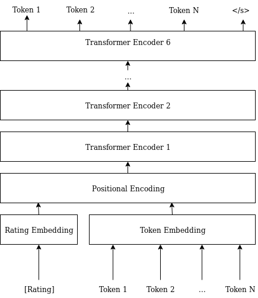

# movie-title-generator
I wanted to learn how to use and train a [Transformer][0] (in a [pytorch][1] environment). This is my (not so serious) attempt at it.

I collected a dataset of about 150k instances of movie titles (english, plus other languages as well), along side with their IMDB ratings.
The objective was to generate a random movie title considering the input rating, so that the generated title is conditioned on the input rating (i.e. a lower rating should produce a movie title that if had existed it would have gotten a bad rating on IMDB).
The resulting language model is modeling the following probabilities:

> P(token1 | [rating])  
> P(token2 | [rating] token1)  
> P(token3 | [rating] token1 token2)  
> ...  
> P(tokenN | [rating] token1 token2 ...)

I'm not uploading the dataset here, but I've uploaded the model weights so you can try to generate titles on your machine.

## Model architecture and training
The encoder/decoder architecture was completely dispensed with by just using a stack of 6 transformer encoder layers.
Ratings and tokens uses different embeddings to keep the concepts separate within the neural network.

The text is tokenized by using byte-pair encoding ([sentencepiece][2]). The BPE model was trained on the dataset.  
The training happens in an unsupervised fashion, using cross entropy loss, teacher forcing, and Noam optimizer.  
Practically, the model learns to predict the next token given the previous context (rating + tokens) (as you can see in the picture above).

The uploaded pretrained model was trained with batch size = 512, d_model = 128, n_head = 4, dim_feedforward = 512 and 6 stacked transformers.  
There isn't a proper reason behind the choice of these values, I just wanted to train it as fast as I could and also get "good" results.  
I stopped the training at epoch 1120 with a average loss per batch of roughly 3.13.  
Since the loss is still far from good, don't expect too much from this pretrained model.  

## Examples
multinomial with temperature sampling = 0.8 (no top_k or top_p sampling used/implemented)
> $ python3 eval.py --samples 10 4.5 
> Tall Wave  
> Yamamama  
> Wild Dr. Bay  
> The Witch We Getting Well Lords  
> The Secret of War  
> Un napriso tis amigos  
> The Lonesomes of Destrada  
> Don't Kill  
> The Black Curse of Saghban  
> Ghosts of the Skateboard  
> $ python3 eval.py --samples 10 7.8  
> The Crazy  
> East Angel  
> Time Spaceship  
> Una noche tu vida de Sabra  
> Waver, Paradel  
> The Scarecrow  
> Unearthed Encounter  
> Terror of the End  
> To Best of Those West  
> You Are Ends  

Have fun!

[0]: https://arxiv.org/abs/1706.03762
[1]: https://pytorch.org/
[2]: https://github.com/google/sentencepiece 
